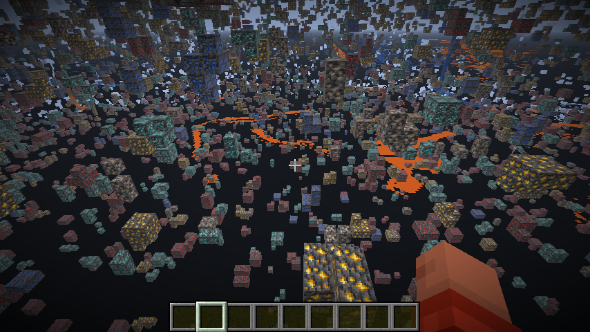

# XRay Mod

A lightweight Minecraft client-side mod for Fabric that enables X-Ray vision and FullBright features to help you find valuable blocks and explore dark areas.




## Features

- **X-Ray Mode:** See only selected blocks (ores, chests, spawners, etc.) through walls.
- **FullBright Mode:** Instantly maximizes gamma for full brightness in all environments.
- **Configurable Keybinds:** Toggle X-Ray (`X` by default) and FullBright (`C` by default).

## Installation

1. Download and install [Fabric Loader](https://fabricmc.net/use/installer/)
2. Download [Fabric API](https://modrinth.com/mod/fabric-api) for Minecraft 1.21.7
3. Download the latest xray release
4. Place both the Fabric API and xray `.jar` files in your `mods` folder
5. Launch Minecraft with the Fabric profile

## Usage

- Press `X` to toggle X-Ray mode.
- Press `C` to toggle FullBright mode.

## Building from Source

```bash
git clone git@github.com:Deltinha/xray.git
cd xray
./gradlew build
```

The built mod will be in `build/libs/xray-1.0.0.jar`

## Developing

To run and test the mod in a development environment:

Java 21 must be installed and set as your active JDK.
You can verify it with:
```bash
java -version
```  

Clone the repository
```bash
git clone git@github.com:Deltinha/xray.git
cd xray
```

Run Minecraft in dev mode
```bash
./gradlew runClient 
```

This command will launch a development instance of Minecraft with your mod pre-loaded. You can use it to quickly test changes during development.

## TODO
- [ ] Add more options to add/remove blocks to/from the X-Ray list
- [ ] Fix rendering of liquids (water/lava). Currently only the surface is rendered, not the full block.
- [ ] Add Sodium compatibility

## License

This project is MIT licensed. See `LICENSE` for details.
